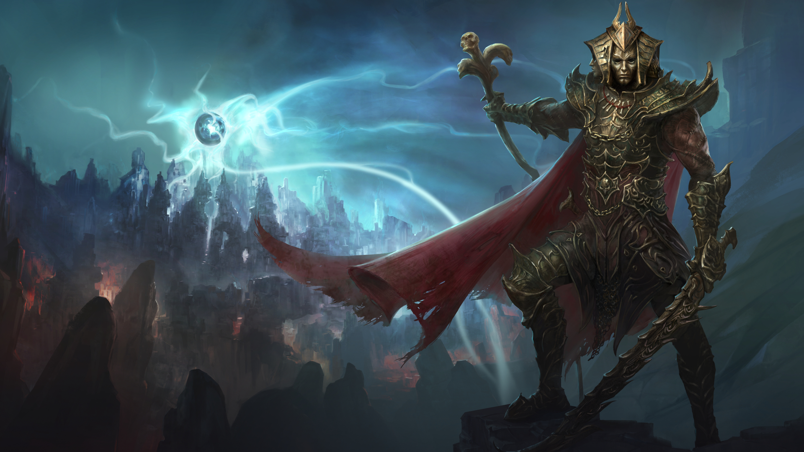

# Практичне заняття 1: Оптимізація зображень за допомогою Squoosh
## Дубограй Максим ІПЗ_2.01

## Аналіз вхідних файлів

Фото, які будуть порівнюватись:

- **Сheetah**: 2048x1421, 450 kB, .jpg

- **Fane**: 1920x1080, 3.29 MB, .png

  
- **PDFIcon**: 800х800, 2.60 kB, .svg

## Таблиця порівняння розмірів файлів

| Name     | Orig   | PNG (lossless) | WebP (lossless) | MozJPEG (100%) | WebP (100%) | AVIF (100%) | MozJPEG (75%) | WebP (75%) |
|----------|--------|---------------|----------------|----------------|-------------|-------------|--------------|------------|
| **Сheetah** | 450 kB | 4.33 MB      | 1.43 MB       | 1.16 MB       | 848 kB      | 649 kB      | 301 kB       | 213 kB     |
| **Fane**   | 3.29 MB | 3.29 MB      | 2.04 MB       | 1.61 MB       | 472 kB      | 653 kB      | 116 kB       | 78.1 kB    |
| **PDFIcon** | 2.60 kB | 28.5 kB      | 3.65 kB       | 4.08 kB       | 4.77 kB     | 5.00 kB     | 2.21 kB      | 4.79 kB    |

| Name     | Orig   | AVIF (75%) | MozJPEG (50%) | WebP (50%) | AVIF (50%) | WEB (1200px) | Mobile (600px) | Retina-дисплей (2х) |
|----------|--------|-----------|--------------|------------|------------|--------------|--------------|-----------------|
| **Сheetah** | 450 kB | 311 kB    | 170 kB      | 153 kB    | 152 kB    | 147 kB       | 45.8 kB      | 929 kB          |
| **Fane**   | 3.29 MB | 106 kB    | 68.5 kB     | 55.7 kB   | 44.4 kB   | 1.37 MB      | 364 kB       | 11.2 MB         |
| **PDFIcon** | 2.60 kB | 3.46 kB   | 2.34 kB     | 4.79 kB   | 2.79 kB   | 2.60 kB      | 2.60 kB      | 2.60 kB         |

## Висновки

### Вибір формату для різних типів зображень

- **Фотографії та реалістичні зображення** найкраще зберігати у форматі JPG, оскільки він забезпечує ефективне стиснення без значних втрат якості. 
- **PNG** ідеально підходить для випадків, коли у зображенні є багато ліній або тексту. Цей формат дозволяє використовувати прозорі області на зображенні.
Але у скріншоті, який я обрав, немає прозорих ділянок та тексту. Тому використання PNG для нього тільки в рази збільшує його розмір.
- **SVG** найкращий для значків, логотипів та векторної графіки, оскільки масштабується без втрати якості.

### Вплив зміни розміру на оптимізацію

- Зменшення розміру зображень знижує вагу файлу, що прискорює завантаження сторінок у вебі.
- У форматах **JPG та PNG** зменшення розміру може призводити до втрати деталей та зниження якості зображення.
- **SVG** залишається чітким при будь-якому масштабуванні, що робить його ідеальним для адаптивного дизайну.

### Адаптація зображень для Retina-дисплеїв

- Для растрових форматів **JPG, PNG** треба використовувати зображення в **подвійному або потрійному розмірі (2х, 3х)**.
- **SVG** завжди залишається чітким, тому він є найкращим вибором для іконок та графіки в інтерфейсі.
