# Практичне заняття 2

## Дослідження кольорових гармоній та інструментів аналізу кольору в Adobe Color

## Дубограй Максим ІПЗ_2.01

### Теоретична частина

**Контраст кольорів** — це співвідношення між кольорами, яке створює візуальну напругу або виразність. У дизайні контраст використовується для привертання уваги, акцентування елементів, покращення читабельності та створення ієрархії.

| Тип                      | Логіка побудови                                                    | Візуальний ефект                                                                          |
|--------------------------|--------------------------------------------------------------------|--------------------------------------------------------------------------------------------|
| **Analogous**            | Використовуються кольори, розташовані поруч на колірному колі      | Створює спокійний, природний вигляд без різких переходів                                 |
| **Monochromatic**        | Варіації одного кольору (тон, яскравість, насиченість)             | Гармонійний, стриманий вигляд, іноді менш виразний                                        |
| **Triad**                | Три рівновіддалені кольори на колі                                | Баланс контрасту та гармонії, динамічний вигляд                                           |
| **Complementary**        | Кольори, розташовані напроти один одного                         | Сильний контраст, акцент на елементах                                                     |
| **Split Complementary**  | Один основний + два сусідніх до його комплементарного             | Менш агресивна альтернатива прямому контрасту, зберігає динаміку                          |
| **Square**               | Чотири кольори, рівномірно розташовані на колі                    | Різноманіття кольорів, яскравість, потребує балансу                                       |
| **Custom**               | Кольори обрані інтуїтивно, без чітких правил                     | Дає свободу творчості, може бути як гармонійним, так і суперечливим                      |

---

### Скріншоти палітр:

**Базовий колір для всіх палітр:** `#EB2F35`

#### Analogous:

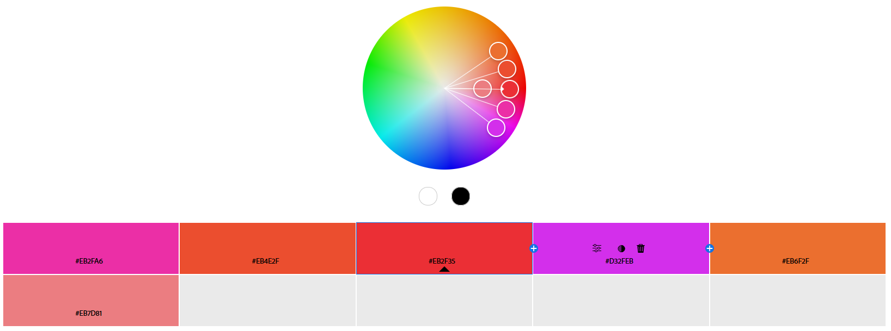

- **Логіка:** Відтінки, розташовані поруч у спектрі (наприклад: зелений, салатовий, бірюзовий).
- **Ефект:** Єдність і плавність. Добре підходить для дизайнів зі спокійним настроєм.

#### Monochromatic:

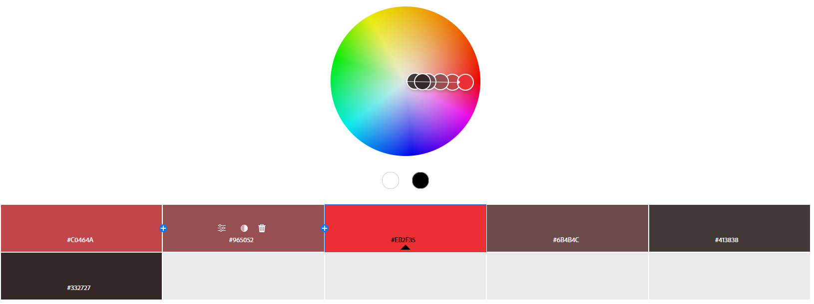

- **Логіка:** Варіації одного кольору через зміну тону, насиченості, світлоти.
- **Ефект:** Вишуканість і простота. Композиція цілісна, хоча може бути не дуже виразною.

#### Triad:

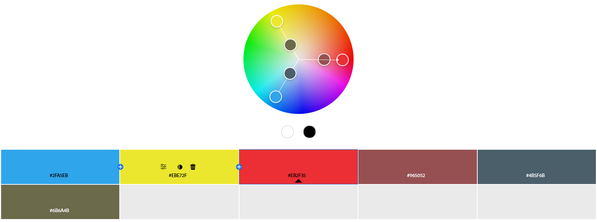

- **Логіка:** Три кольори на рівній відстані в колі (наприклад: синій, червоний, жовтий).
- **Ефект:** Динаміка з гармонією. Контраст м’який, але виразний.

#### Complementary:

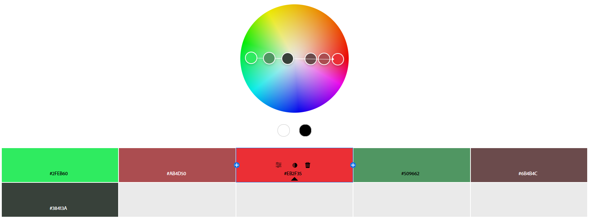

- **Логіка:** Два кольори, що стоять один навпроти одного в колі.
- **Ефект:** Яскравий контраст. Підходить для акцентів, потребує обережності.

#### Split Complementary:

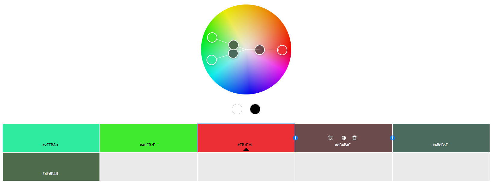

- **Логіка:** Основний колір + два по обидва боки від протилежного.
- **Ефект:** М’який, але все ще контрастний вигляд. Гармонійний баланс.

#### Square:

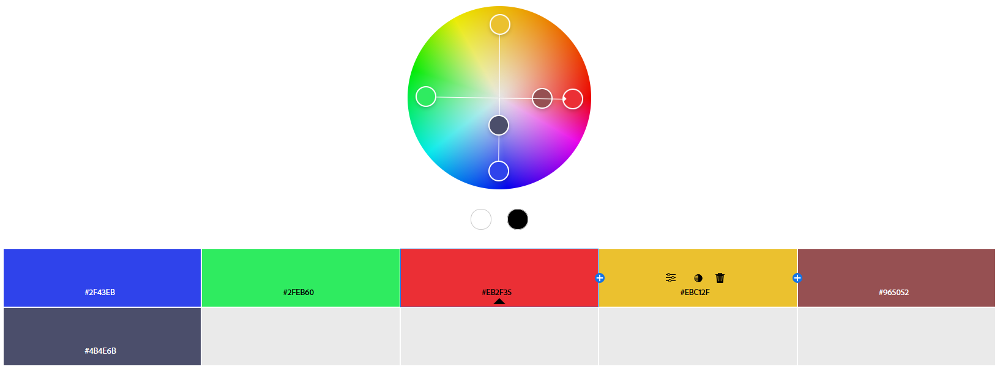

- **Логіка:** Чотири кольори, що формують квадрат на колі.
- **Ефект:** Різнобарвність та інтенсивність. Потребує чіткого впорядкування.

#### Custom:

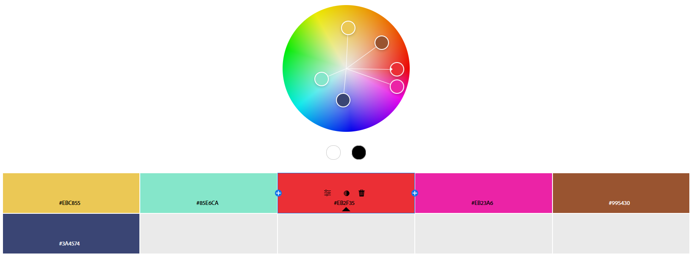

- **Логіка:** Інтуїтивний підбір кольорів без прив'язки до стандартних схем.
- **Ефект:** Унікальний характер. Може бути як гармонійним, так і хаотичним — залежно від реалізації.

---

### Скріншоти Extract Theme та Extract Gradient

#### Extract Theme:

- **Colorful:**  

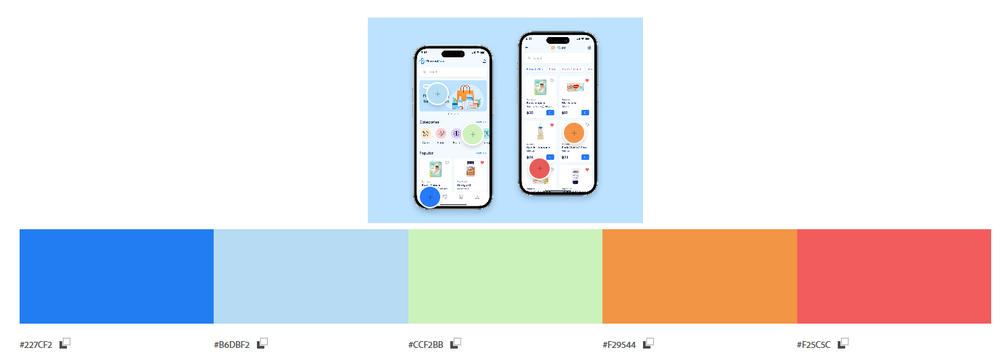

  Настрій — живий, динамічний.

- **Muted:**  

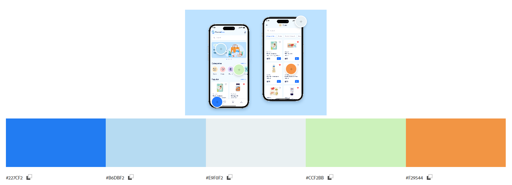

  Настрій — стриманий, витончений.

#### Extract Gradient:

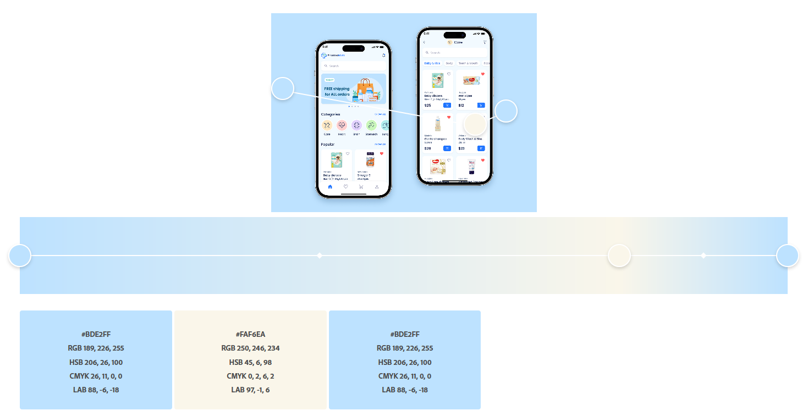

  Настрій — простий, спокійний

---

### Скріншот аналізу контрастності

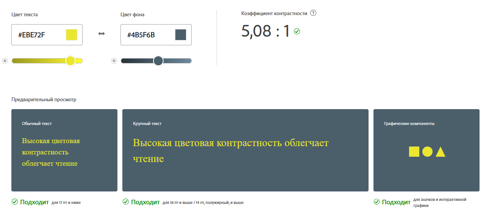

---

### Висновок

У дизайні інтерфейсів важливо обирати кольорові гармонії, що полегшують сприйняття, створюють достатній контраст і формують чітку візуальну ієрархію.  
Монохромні та аналогові палітри додають охайності та спокою — ідеальні для корпоративних і медичних додатків.  
Комплементарні та розділені комплементарні гармонії акцентують ключові елементи, як-от кнопки та повідомлення.  
Часто використовуються індивідуальні палітри з 4–5 кольорів, кожен з яких виконує конкретну роль: тло, основний колір, акцент, попередження тощо.  
Палітра має бути гармонійною та не перевантажувати зорове сприйняття.

---
